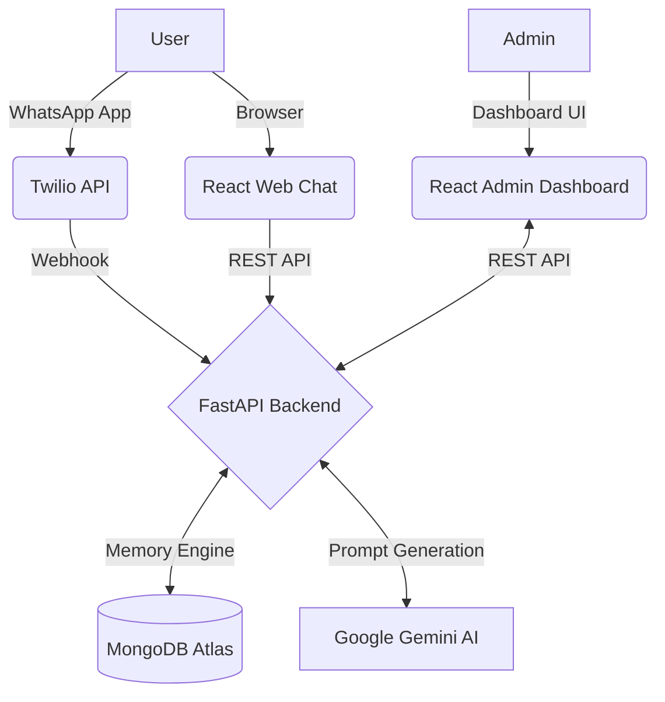

<div align="center">

# 🤖 WPBot AI Platform

**AI-powered WhatsApp and Web Chat Assistant built with FastAPI, Gemini AI, MongoDB Atlas, and React.**

<p align="center">
  
  
  
  
  
  
  
  
</p>

</div>

---

## 📖 Project Overview

WPBot AI is a full-stack AI platform that enables users to interact with an intelligent assistant through both WhatsApp and a modern web interface. 

The system leverages Google's Gemini AI to generate contextual responses, while a custom Semantic Memory Engine running on MongoDB Atlas automatically extracts and persists long-term facts about users (such as profession, coding experience, and interests). Administrators can monitor interactions, view extracted user profiles, and check system health via a beautifully designed, premium dark-theme React dashboard.

## ✨ Features

- **WhatsApp AI Assistant**: Real-time conversational AI integration via Twilio Sandbox.
- **Web Chat Interface**: A modern, ChatGPT-like public UI for browser-based interaction.
- **Gemini AI Integration**: Highly capable, context-aware responses powered by Google.
- **MongoDB Memory System**: Fast, cloud-based persistence of chat logs and user profiles.
- **User Profile Extraction**: Automated extraction of long-term memory (goals, interests, tech stack).
- **Persistent Conversations**: Seamlessly continue conversations across sessions.
- **Admin Dashboard**: Comprehensive CRM for monitoring user interactions and memory status.
- **System Health Monitoring**: Real-time status checks of MongoDB, Gemini, and Twilio infrastructures.
- **Responsive Design**: Beautiful, glassmorphic UI optimized for desktop and mobile.
- **Cloud Deployment**: Fully deployed architecture on Vercel (Frontend) and Render (Backend).

---

## 🏗 Architecture



---

## 📸 Screenshots

### Public Web Chat
*(A beautiful, premium ChatGPT-inspired UI for public interactions)*


### Admin Dashboard Overview
*(Real-time analytics and activity monitoring)*


### Users Management & Memory Status
*(CRM showing active users and their current Memory extraction level)*


### Chat History & Extracted Facts
*(Deep dive into a specific user's conversation and auto-extracted facts)*


### System Health
*(Real-time infrastructure monitoring)*


*(Note: Create a `screenshots` folder and replace the above images with your own captures)*

---

## 🛠 Tech Stack

**Frontend:**
- React 18
- TypeScript
- Tailwind CSS
- Framer Motion
- Recharts
- Vite

**Backend:**
- Python 3.10+
- FastAPI
- Motor (Async MongoDB)
- Pydantic

**AI & Cloud Infrastructure:**
- Google Gemini AI (LLM)
- MongoDB Atlas (Database)
- Twilio WhatsApp API (Messaging Gateway)
- Render (Backend Hosting)
- Vercel (Frontend Hosting)

---

## 📁 Project Structure

```text
WPBot/
├── frontend/                # React Admin Dashboard & Web Chat
│   ├── src/
│   │   ├── components/      # Reusable UI components
│   │   ├── layouts/         # Dashboard wrapper
│   │   ├── pages/           # ChatViewer, Dashboard, WebChat, etc.
│   │   └── utils/           # Date formatting and helpers
│   └── package.json
├── src/                     # FastAPI Backend Application
│   ├── api/                 # API Routes (Dashboard, Chat, WhatsApp)
│   ├── config/              # Environment Settings & System Prompts
│   ├── database/            # MongoDB connection logic
│   ├── models/              # Pydantic Schemas
│   └── services/            # Core Logic (Gemini, Memory, Twilio)
├── screenshots/             # Repository preview images
├── README.md                # Project documentation
└── .env.example             # Environment variables template
```

---

## 🚀 Installation & Local Setup

### 1. Clone Repository
```bash
git clone https://github.com/yourusername/AI-WhatsApp-Assistant.git
cd AI-WhatsApp-Assistant
```

### 2. Backend Setup
```bash
# Create and activate a virtual environment
python -m venv venv
source venv/bin/activate  # On Windows use: venv\Scripts\activate

# Install dependencies
pip install -r requirements.txt

# Start the FastAPI server
uvicorn src.main:app --reload --host 0.0.0.0 --port 8000
```

### 3. Frontend Setup
```bash
# Navigate to the frontend directory
cd frontend

# Install dependencies
npm install

# Start the Vite development server
npm run dev
```

### 4. Configuration
Create a `.env` file in the root directory based on the provided `.env.example`.

---

## 🔑 Environment Variables

Create a `.env` file in the root directory. Use `.env.example` as a template:

```env
# Server
HOST="0.0.0.0"
PORT=8000

# Database
MONGODB_URL="mongodb+srv://<username>:<password>@cluster.mongodb.net/?retryWrites=true&w=majority"
DB_NAME="whatsapp_ai_bot"

# Gemini AI
GEMINI_API_KEY="your_google_gemini_api_key"
GEMINI_MODEL="gemini-1.5-flash"

# Twilio Configuration
TWILIO_ACCOUNT_SID="your_twilio_account_sid"
TWILIO_AUTH_TOKEN="your_twilio_auth_token"
TWILIO_WHATSAPP_FROM="whatsapp:+14155238886"

# Admin Dashboard Defaults
ADMIN_USERNAME="admin"
ADMIN_PASSWORD="admin123"
```

---

## ☁️ Deployment

**Frontend (Vercel)**
- Connect the GitHub repository to Vercel.
- Set the root directory to `frontend/`.
- Add `VITE_API_BASE_URL=https://your-backend-url.onrender.com/api` to environment variables.

**Backend (Render)**
- Connect the GitHub repository to Render as a Web Service.
- Build Command: `pip install -r requirements.txt`
- Start Command: `uvicorn src.main:app --host 0.0.0.0 --port $PORT`
- Add all required variables from `.env` into the Render environment settings.

**Database (MongoDB Atlas)**
- Whitelist the Render IP addresses (or allow all IPs `0.0.0.0/0`).

---

## 🌟 Why This Project Matters (Resume Highlights)

- **Full-Stack Architecture**: Demonstrates the ability to architect, build, and deploy an end-to-end system spanning database, backend logic, and frontend UI.
- **AI Integration**: Implements modern LLM pipelines using Google Gemini, showcasing prompt engineering and structured JSON extraction.
- **Semantic Memory**: Builds a custom long-term memory engine to persist and utilize contextual facts across distinct sessions.
- **Dashboard Development**: Showcases complex React patterns, robust error handling, data visualization (Recharts), and responsive design (Tailwind).
- **Real-world API Integrations**: Successfully connects Twilio webhooks, MongoDB drivers, and RESTful paradigms.

---

## 🔮 Future Improvements

- [ ] Voice note transcription & generation capabilities.
- [ ] Image and document understanding (Multimodal).
- [ ] Multi-user authentication & role-based access for the Admin CRM.
- [ ] Advanced analytics and data export functionalities.
- [ ] Transition from Twilio Sandbox to Production WhatsApp Business API.

---

## 📜 License

This project is licensed under the MIT License - see the LICENSE file for details.
