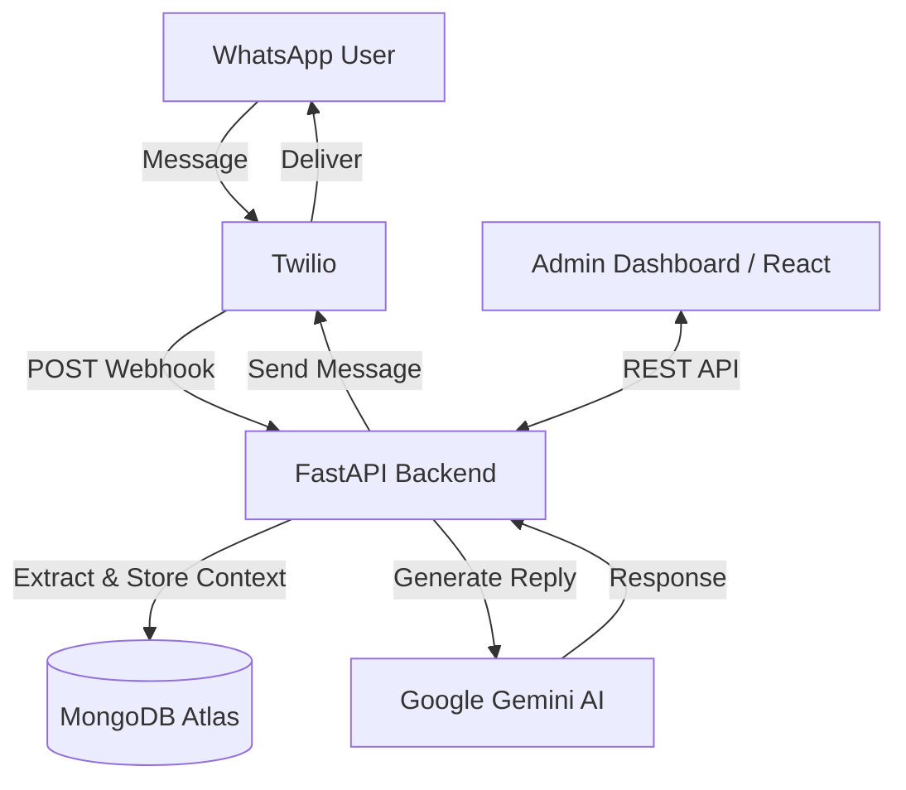

# WPBot AI

  

AI-powered WhatsApp Assistant built with FastAPI, Gemini AI, MongoDB Atlas, Twilio WhatsApp API, and React. This project demonstrates a complete, production-ready full-stack architecture that extracts insights, maintains persistent memory, and operates smoothly across multiple services.

## Features

* **WhatsApp AI Chatbot**: Real-time contextual conversations through Twilio integration.
* **Persistent Memory**: Semantic memory extraction engine saves relevant user facts automatically.
* **User Profiles**: Detailed tracking of user interactions, interests, and coding goals.
* **Admin Dashboard**: Sleek, recruiter-friendly interface for managing the CRM.
* **MongoDB Atlas Integration**: Highly-available database storage with indexing.
* **Gemini AI Responses**: Intelligent LLM routing utilizing Gemini 2.5 Flash-Lite.
* **Conversation History**: Beautiful WhatsApp-style UI for reviewing past chats.
* **System Monitoring**: Live health checks across APIs and Databases.

## Architecture



## Tech Stack

**Frontend:**
* React + TypeScript + Vite
* Tailwind CSS + Framer Motion
* Recharts (Data Visualization)

**Backend:**
* FastAPI (Python)
* Pydantic (Data Validation)
* Motor (Async MongoDB Driver)
* PyJWT (Authentication)

**Database:**
* MongoDB Atlas

**AI & Messaging:**
* Google Gemini AI API
* Twilio WhatsApp API

## Screenshots

*(Ensure screenshots are uploaded to the `screenshots/` directory before committing)*

1. **Dashboard Overview**: `screenshots/dashboard.png`
2. **Users Page**: `screenshots/users.png`
3. **Chat History**: `screenshots/chat_history.png`
4. **AI Memory System**: `screenshots/ai_memory.png`
5. **System Health**: `screenshots/system_health.png`

## Installation

### 1. Clone the repository
```bash
git clone <your-repo-url>
cd WPBot
```

### 2. Backend Setup
```bash
# Create and activate a virtual environment
python -m venv venv
source venv/bin/activate  # Windows: venv\Scripts\activate

# Install required Python packages
pip install -r requirements.txt

# Start the FastAPI server
uvicorn src.main:app --reload --host 0.0.0.0 --port 8000
```

### 3. Frontend Setup
```bash
cd frontend

# Install Node modules
npm install

# Start the Vite development server
npm run dev
```

## Environment Variables

Copy the provided template and fill in your actual API keys.

```bash
cp .env.example .env
```
Ensure you provide `MONGODB_URL`, `GEMINI_API_KEY`, `TWILIO_ACCOUNT_SID`, and `TWILIO_AUTH_TOKEN`.

For the frontend, configure the base API URL in `frontend/.env`:
```env
VITE_API_BASE_URL=http://localhost:8000/api
```

## Deployment

This repository is optimized for modern PaaS platforms:

* **Backend**: Configured for [Render](https://render.com) (see `render.yaml`).
* **Frontend**: Configured for [Vercel](https://vercel.com) (see `frontend/vercel.json`).
* **Database**: Configured for [MongoDB Atlas](https://mongodb.com).

To deploy:
1. Connect this GitHub repository to Render for the backend.
2. Connect the `frontend/` directory to Vercel for the UI.
3. Configure your Twilio WhatsApp Sandbox Webhook to point to `https://<YOUR-RENDER-URL>.onrender.com/api/webhook`.

## Resume Highlights

*Developed an AI-powered WhatsApp chatbot using FastAPI, Gemini AI, MongoDB Atlas, Twilio WhatsApp API, and React. Implemented persistent conversation memory, user profiling, admin analytics dashboard, and real-time chat monitoring using a scalable cloud-based architecture.*
